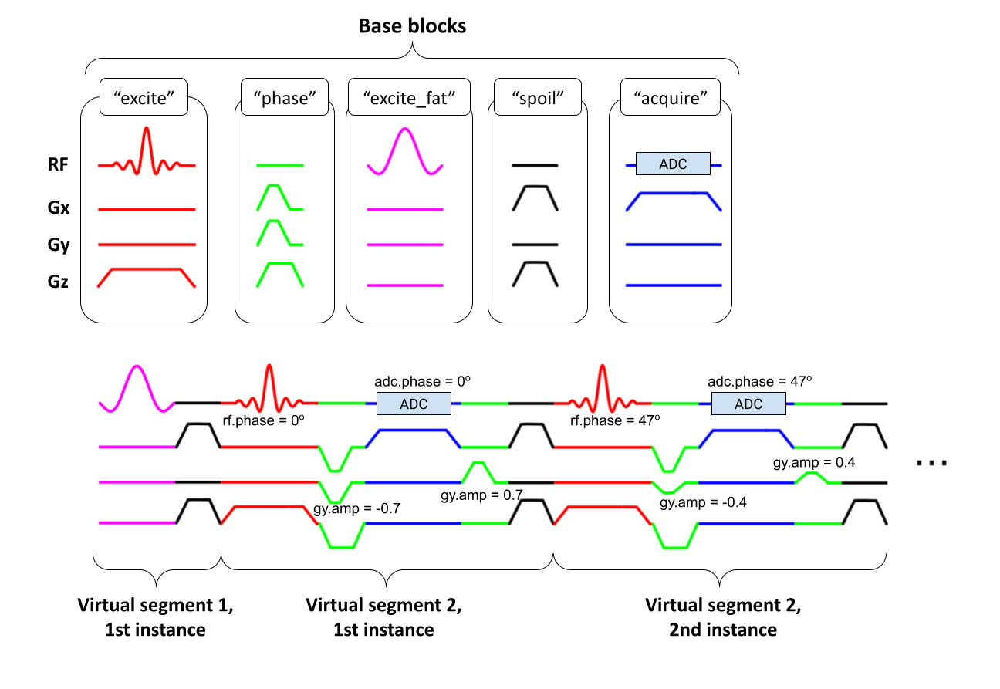

<p align="left">
  
</p>

**A vendor-neutral intermediate representation for Pulseq MRI sequences**

🛠️ Under Development

---

## Overview

`PulSeg` provides a robust, standardized pipeline for converting [Pulseq](https://pulseq.github.io/) MRI pulse sequence files into a segment-based **intermediate representation**. This abstraction enables translation of Pulseq sequences to certain hardware platforms such as GE.

*Project status:
Version 1.0 of the intermediate representation specification is now formalized – see [`docs/spec.md`](docs/spec.md).*

---

## Key Concepts

- **Base Block**
  The fundamental normalized atomic building blocks (`excite`, `acquire`, `spoil`, etc.).

- **Virtual Segment**
  Ordered sequences of base blocks (abstract “cores”).

- **Segment Instance**
  Specific realizations of virtual segments in the scan loop, with defined amplitudes, phases, and offsets.



---

## Why Pulseg?

- Aids Pulseq file interpretation across hardware platforms
- Enables efficient sequence modularity and parameterization
- Preserves benefits of Pulseq: Facilitaties rapid prototyping, simulation, and optimization workflows

---

## Installation

Clone the repository:
```bash
git clone https://github.com/HarmonizedMRI/pulseg.git
```
<!---
See [`docs/install.md`](docs/install.md) for up-to-date install instructions.
--->

---

## Usage

> For a high-level overview, see [`docs/spec.md`](docs/spec.md).

Basic usage:

1. Create the Pulseq (`.seq`) file. Assign `TRID` label to the first block in each segment instance.
2. 
2.  Convert to PulSeg intermediate representation
    ```matlab
    psq = pulseg.fromSeq('path/to/your/sequence.seq');
    ```

---

## Documentation

- [Intermediate Representation Specification (v1.0)](docs/spec.md)
- [Install instructions](docs/install.md)
- [Changelog](docs/changelog.md)

---

## Contributing

Contributions are welcome!
- Open issues for bugs or feature requests
- Submit pull requests (please work off the `main` branch!)

---

## License

This repository is licensed under [MIT](LICENSE).

---

## Citation

If you use `PulSeg` for your research, please cite:

```
pulseg: A Harmonized Intermediate Representation for MRI Sequence Files, HarmonizedMRI Consortium, 2026.
```

---

## Contact

Questions or feedback?
Open a [GitHub Issue](https://github.com/HarmonizedMRI/pulseg/issues) or email: *your-address@your-domain.edu*

---

*Go Blue!*


---

